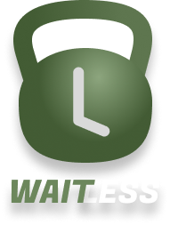

# Team-14 - Waitless

Your personal gym equipment queue manager!

## The Team

| Name | Email | Development Journal |
| -------- | ------ | --- |
|Harshitha Durai Babu|hduraiba@uwaterloo.ca|[Link](../../wikis/Development-Journal:-Harshitha)|
|Michael Mavely|mmavely@uwaterloo.ca|[Link](../../wikis/Development-Journal:-Michael)|
|Ashna Nadar|ashna.nadar@uwaterloo.ca|[Link](../../wikis/Development-Journal:-Ashna)|
|Abhinit Patil|a33patil@uwaterloo.ca|[Link](../../wikis/Development-Journal:-Abhinit)|

## Links
- [User Documentation](../../wikis/User-Documentation)
- [Design Documentation](../../wikis/Design-Documents)
- [Release Notes](../../wikis/Release-Notes)
- [Meeting Minutes](../../wikis/Meeting-Minutes)
- [Project Proposal](../../wikis/Project-Proposal)

## Using the ENV vars:
- TODO

## Design Pattern

**MVVM Pattern**
MVVM offers two-way binding between view and view-model. It makes use of the  observer pattern to make changes in view model
- Model: stores data + related logic (interacts with DB)
- View: standard UI components + pages
- View-Model: functions, commands, methods to support state of Views

## Folder Structure
- TODO

